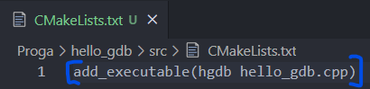
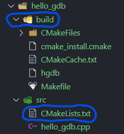

# Отладка (Linux)

## Подготовка к отладке

1.  В папке `src` создаем файл `CMakeLists.txt` 
2. В файле `CMakeLists.txt` пишем `add_executable(<отладочный файл> <исходные файлы>…)`
3. В папке `build` пишем команду `cmake -DCMAKE_BUILD_TYPE=Debug ../src/`
4. В папке `build`  пишем команду `cmake --build .` (точка в конце означает читать папку, на которой мы находимся)

## Начать отладку

- В папке `build` пишем команда:
    - `gdb ./hgdb`| можно написать `gdb -silent ./hgdb` — запускает отладку без доп записей
    - `b main` → `r` — чтобы начать отладку
    - `start` — совмещает в себе 2 команды сразу {`b main` → `r`}

## Общие команды

- ***Команды:***
    - `q` — выйти из отладки
    - `continue (n)` — продолжить выполнение
    - `refresh` — обновить окно отладки
    - `info functions` — вывести весь список доступных функций
    - `info functions .*[FileName]` — вывести список доступных функций файла *FileName*
    - `*l*` — вывести код
    - `display [переменная]` — вывести значение переменной

## Команды пошаговой отладки

- ***Команды:***
    - `next (n)` — сделать шаг далее
    - `step (s)` — сделать шаг внутрь
    - `finish` — выполнить до возврата из функции
    - `until (u) {n-ая строка}` — выполнить до n-ой строки

## Точки остонова (breakpoints)

- ***Команды:***
    - `break (b)` — установить точку остонова на текущей строке
    - `break (b) [FileName:]n` — установить точку остонова в файле *FileName* ( если указан, либо в текущем файле) на строке *n*
    - `break (b) [FileName:]function` —  установить точку остонова в файле *FileName* ( если указан, либо в текущем файле) на указанной функции
    - `break (b) +n` — установить точку остонова ниже на *n* строк в текущем файле
    - `break (b) -n` — установить точку остонова выше на *n* строк в текущем файле
    - `break [n-ой] if condition` — установить точку остонова с условием. Аргументы такие как у обычной *break*, но остановка выполнения произойдет только при выполнении условия  *condition*
    - `tbreak [n-ой]` —  разово установить точку остонова. Аргументы такие как у обычной *break*. После остановки выполнения в данной точке она будет автомотически удалена
    - `info breakpoints` — вывести информацию обо всех точках остонова
    - `disable [breakpoints] [n-m]` — деактивировать точки остонова в диапазоне
    - `enable [breakpoints] [n-m]` — активировать точки останова в диапазоне

### Удаление точек остонова

- ***Команды:***
    - `clear` — удалить точку останова в текущей строке
    - `clear [FileName:]n` — удалить точку останова в файле *FileName* (если указан, либо в текущем файле) в строке *n*
    - `clear [FileName:]function` — удалить точку останова в файле *FileName* (если указан, либо в текущем файле) на указонной функции
    - `delete (d) [breakpoints] [n-m]` — удалить точки останова в диапазоне
    - `delete (d)` — удалить все точки останова

## Точка наблюдения (watchpoints)

> *Особая точка останова, которая срабатывает при изменении выражения*
> 
- ***Команды:***
    - `watch expression` — остановить при изменении выражения
    - `rwatch expression` — остановить при чтении выражения
    - `awatch expression` — остановить при записи или чтении
    - `info watchpoints` — вывести информацию обо всех точках наблюдения

## Просмотр данных

- ***Команды:***
    - `info (i) locals` — вывести переменные текущего стекового кадра
    - `info (i) args` — вывести аргументы текущей функции
    - `info (i) frame` — вывести информацию о текущем стековом кадре
    - `info registers` — вывести содержимое региторов в процессоре
    - `print (p) / f expression` —вывести результат выражения
    - `x / nfu address` — просмотр *(examine)* памяти, где:
        - `n` — количество выводимых единиц данных *(n)*, по умолчанию 1
        - `f` — формат отображения: *x* —16-ый, по умолчанию, *d* — десятичный со знаком, *u* — десятичный без знака, *f* — с плавающей точкой, *s* — строка
        - `u` — единица данных: *b* — байт, *h* — полуслово (2 байта), *w* — слово (4 байта), g — длинное слово (8 байт)
    - `display expression` — автоматическое отображение выражения
    - `undisplay [n]` — удалить отображение переменной

## Изменение данных

- ***Команды:***
    - `print v=value` — присвоить переменной *v* новое значение *value* и вывести это значение на экран
    - `set var v=value` —  присвоить переменной *v* новое значение *value*

## Исследование стека

- ***Команды:***
    - `where`
    - `info (i) stack`
    - `backtrace n`
    - `bt n` — вывести информацию о стеке (по строке каждый кадр). *n* позволяет задать кол-во выводимых кадров
    - `frame (f) n` — переключиться на кадр *n*. По умолчанию *n=0*, т.е. буз указания *n* будет выведен текущий кадр стека
    - `up n` — переключиться на *n* кадров вверх
    - `down n` — переключиться на *n* кадров вниз
    - `info (i) frame (f)` — вывести подробную информацию о кадре

## Точки перехвата (catchpoints)

> *Позволяют остановить отладку при возникновении определенных событий:*
> 
- ***Команды:***
1. *Перехват С++ исключений:*
    - `catch [re]throw [regex]`
    - `catch catch [regex]`
2. *Вызов системных функций:*
    - `catch syscall write`
3. *Загрузка / выгрузка .so файлов:*
    - `catch [un]load [regex]`

## Отладка с core дампами

- ***Команды:***
    - `ulimit -a`
    - `ulimit -c unlimited`
    - `ulimit -c 0` → `sudo sh -c ”unlimited && exec su (логин)”`
    - `mc`